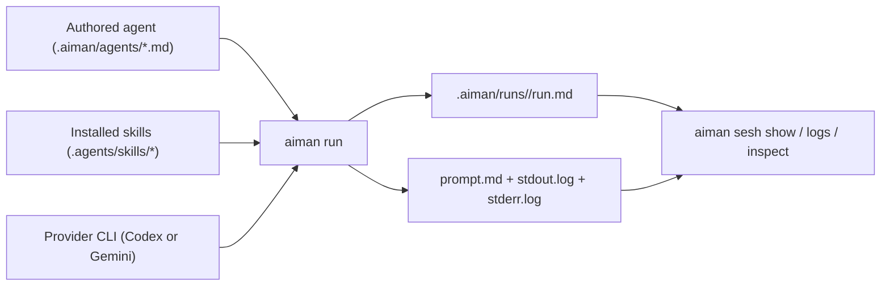

# `aiman`

> A small CLI for running one authored specialist at a time, then keeping a trustworthy record of what happened.

`aiman` is for teams that want lightweight, file-based agent runs instead of a bigger orchestration system. You define specialists as Markdown files, run them through a provider like Codex or Gemini, and inspect the saved session later through simple CLI commands.

## Why It Exists

Most agent tooling jumps quickly into orchestration, routing, and background systems. `aiman` stays narrower:

- one specialist per run
- explicit agent files
- explicit skills and MCP requirements
- persisted prompts, logs, and run metadata
- simple CLI-first inspection

If you want a boring, inspectable way to author specialists and keep a durable record of each run, this is the shape.

## Mental Model



## Core Concepts

| Concept          | What it is                                                    | Where it lives                           |
| ---------------- | ------------------------------------------------------------- | ---------------------------------------- |
| Agent            | A specialist prompt with YAML frontmatter and a Markdown body | `.aiman/agents/` or `~/.aiman/agents/`   |
| Skill            | Provider-native reusable guidance an agent can declare        | `.agents/skills/` or `~/.agents/skills/` |
| Run              | One execution of one agent                                    | `.aiman/runs/<run-id>/`                  |
| Session commands | Read the saved run state                                      | `aiman sesh ...`                         |

## Quick Start

### 1. Install dependencies

```bash
npm install
```

### 2. Make the CLI available everywhere

```bash
npm run install:global
```

That builds `dist/` and links the `aiman` binary into your global npm bin so you can run `aiman ...` from any directory.

If you want to remove it later:

```bash
npm run uninstall:global
```

### 3. Create an agent

```bash
aiman agent create reviewer \
  --scope project \
  --provider codex \
  --permissions read-only \
  --model gpt-5.4-mini \
  --description "Reviews diffs" \
  --instructions "Review the current patch and call out concrete bugs."
```

### 4. Inspect the agent

```bash
aiman agent show reviewer --scope project
```

### 5. Run it

```bash
aiman run reviewer --scope project --task "Review my current changes"
```

### 6. Inspect the saved session

```bash
aiman sesh list --all
aiman sesh show <run-id>
aiman sesh logs <run-id>
aiman sesh inspect <run-id>
```

## CLI Overview

### Agent Commands

Use these to create and inspect authored specialists.

| Command                                        | Purpose                                                    |
| ---------------------------------------------- | ---------------------------------------------------------- |
| `aiman agent list [--scope project&#124;user]` | List available agents                                      |
| `aiman agent show <agent> [--scope ...]`       | Show one agent's provider, permissions, skills, and prompt |
| `aiman agent create <name> ...`                | Create a new agent file                                    |

### Skill Commands

Use these to discover the skill names agents can declare.

| Command                                        | Purpose                                                  |
| ---------------------------------------------- | -------------------------------------------------------- |
| `aiman skill list [--scope project&#124;user]` | List available skills with project-over-user precedence  |
| `aiman skill install [source] [--scope ...]`   | Install the default aiman skill, or one from a path/repo |

### Run Commands

Use these to execute a specialist.

| Command                           | Purpose                                           |
| --------------------------------- | ------------------------------------------------- |
| `aiman run <agent> --task <text>` | Run in the foreground and return the final result |
| `aiman run <agent> --detach`      | Start a background run and return immediately     |

Foreground runs wait for completion and print the final answer on success. Detached runs persist the same run contract, but execute from the launch snapshot already frozen into `run.md` and `prompt.md`.

### Session Commands

Use these to inspect what already happened.

| Command                                 | Purpose                                           |
| --------------------------------------- | ------------------------------------------------- |
| `aiman sesh list [--all] [--limit <n>]` | List active runs or recent history                |
| `aiman sesh show <run-id>`              | Show compact per-run status                       |
| `aiman sesh logs <run-id>`              | Read persisted stdout and stderr, optionally live |
| `aiman sesh inspect <run-id>`           | Read the full persisted evidence                  |
| `aiman sesh top [--filter ...]`         | Interactive TTY dashboard for humans only         |

## How Agents Work

An `aiman` agent is a Markdown file with YAML frontmatter plus a provider-native prompt body.

```md
---
name: hello
provider: gemini
description: Respond with a short, friendly greeting
permissions: read-only
model: gemini-2.5-flash-lite
---

## Role

You are the hello specialist.

## Task Input

{{task}}

## Instructions

Respond briefly and warmly.
```

### Required frontmatter

- `name`
- `provider`
- `description`
- `permissions`
- `model`

### Optional frontmatter

- `reasoningEffort`
- `skills`
- `requiredMcps`

### `agent create` requirements

When creating an agent through the CLI, these flags are required:

- `--scope`
- `--provider`
- `--model`
- `--description`

### Important prompt rule

`aiman` does not append a hidden runtime footer anymore. The agent body is the real prompt contract. If the agent should receive the caller's task, include `{{task}}` in the body.

## How Skills Fit In

Skills are not expanded by `aiman` itself. Instead:

1. An agent may declare `skills:` in frontmatter.
2. `aiman run` resolves those names from project scope first, then user scope.
3. The selected provider uses those skills natively.
4. The resolved skill metadata is frozen into the run record for later inspection.

That means `aiman` validates and records skill usage, but does not become a second skill runtime.

### Installing skills

`aiman` resolves skills from two locations:

- project scope: `.agents/skills/<name>/SKILL.md`
- user scope: `~/.agents/skills/<name>/SKILL.md`

`aiman skill install` accepts either a local path or a git URL. When you omit `source`, it defaults to `https://github.com/ogow/aiman` and installs from that repo's `main` branch.

For the default project-scope install, run:

```bash
aiman skill install
```

For a user-wide install into your home folder, run:

```bash
aiman skill install --scope user
```

You can still install from an explicit repo URL:

```bash
aiman skill install https://github.com/ogow/aiman
```

Git and local repo sources can resolve skills in three ways:

- a repo-root `SKILL.md`
- exactly one bundled `skills/<name>/SKILL.md`
- an explicit `--path` pointing at the skill directory inside the repo

If a repo contains more than one bundled skill, choose one explicitly:

```bash
aiman skill install https://github.com/ogow/aiman --path skills/aiman
```

Local paths work both for a direct skill directory and for a checked-out repo root:

```bash
aiman skill install ./skills/aiman
aiman skill install .
aiman skill install . --path skills/aiman
```

`aiman` copies the full selected skill directory into the install target. That can include `references/`, optional host-specific metadata under `agents/`, or other bundled files. The installed skill name comes from frontmatter `name` when present; otherwise `aiman` falls back to the source directory or repo name. Git installs always read from the repo's `main` branch. Use `--force` when you intentionally want to replace an existing installed copy.

Typical installed layout:

```text
.agents/skills/<name>/
  SKILL.md
  ...
```

For user-wide installs, the same folder goes under:

```text
~/.agents/skills/<name>/
```

After installing a skill, verify it with:

```bash
aiman skill list
aiman skill list --scope project
aiman skill list --scope user
```

By default, `aiman skill list` applies the same project-over-user precedence that `aiman run` uses for resolving declared skill names.

Then declare it in agent frontmatter:

```yaml
skills:
   - aiman
```

## Using `aiman` From A Main Agent

`aiman` works best as a specialist runner called by a broader parent agent, wrapper, or automation.

Typical pattern:

1. The main agent decides which specialist to use.
2. It calls `aiman run <agent> ...`.
3. It reads the result directly, or inspects the saved session if it needs more evidence.
4. It keeps orchestration, memory, and next-step decisions outside `aiman`.

For a synchronous handoff:

```bash
aiman run reviewer --scope project --task "Review the current diff"
```

For a machine-readable handoff:

```bash
aiman run reviewer --scope project --task "Review the current diff" --json
```

For background execution:

```bash
aiman run reviewer --scope project --task "Review the current diff" --detach --json
aiman sesh show <run-id> --json
aiman sesh logs <run-id> --follow
aiman sesh inspect <run-id> --json
```

Practical rule:

- let the main agent own orchestration
- let `aiman` own one specialist run plus the persisted evidence
- let provider-native skills stay with the provider instead of trying to re-expand them in the parent

## How Runs Work

When you run an agent, `aiman`:

1. Resolves the agent from project or user scope.
2. Validates provider-specific requirements.
3. Renders `prompt.md` from the agent body and runtime placeholders.
4. Freezes an immutable launch snapshot in `run.md`.
5. Launches the provider CLI.
6. Captures stdout, stderr, and final result.
7. Lets you inspect the saved run later with `sesh` commands.

For detached runs, the worker reloads from the saved launch snapshot instead of re-reading the mutable agent file later.

Each run is stored under:

```text
.aiman/runs/<run-id>/
  run.md
  prompt.md
  stdout.log
  stderr.log
  artifacts/
```

## Providers, Permissions, and MCPs

### Providers

Current providers:

- `codex`
- `gemini`

### Permissions

Agents declare their intended execution mode in frontmatter:

- `read-only`
- `workspace-write`

If the caller passes `--mode`, it must match the agent file. `aiman` will not silently widen or narrow permissions.

Provider behavior stays explicit:

- Codex `read-only`: `codex exec --sandbox read-only`
- Codex `workspace-write`: `codex exec --sandbox workspace-write`
- Gemini `read-only`: `gemini --approval-mode plan`
- Gemini `workspace-write`: `gemini --approval-mode auto_edit`

### MCP requirements

Agents may declare `requiredMcps:`. Before launch, `aiman` checks the selected provider CLI and fails fast when a required MCP is missing or not ready.

## Project vs User Scope

`aiman` can load agents and skills from two places:

- project scope
- user scope

Default lookup prefers project scope when both define the same name. Use `--scope project` or `--scope user` when you want to force one side.

## Human vs Machine Surfaces

`aiman` has both human-friendly text output and machine-friendly JSON output.

- Use normal command output when you're working in a terminal.
- Use `--json` when a wrapper or another tool needs structured data.
- Use `aiman sesh top` only as a real TTY dashboard for humans.
- Use `aiman sesh top --filter historic` or `--filter all` when you want completed runs in the dashboard.

For automation and agentic tooling, prefer:

- `aiman sesh list`
- `aiman sesh show`
- `aiman sesh logs`
- `aiman sesh inspect`

## Development

### Useful commands

```bash
npm run dev
npm run install:global
npm test
npm run lint
npm run typecheck
npm run build
```

### Internal docs

If you want the deeper implementation details, start here:

- [`ARCHITECTURE.md`](./ARCHITECTURE.md)
- [`docs/cli.md`](./docs/cli.md)
- [`docs/agent-runtime.md`](./docs/agent-runtime.md)
- [`MEMORY.md`](./MEMORY.md)
