# aiman



`aiman` is a lightweight MCP server for reusable coding agents.

Its job is simple: keep a small registry of provider-specific agent prompts, run those agents through local CLIs like `codex`, `claude`, or `gemini`, and store run state locally in the repo so the work stays close to the codebase.

## Why This Exists

- Reuse the same specialists across projects without copying prompts around by hand.
- Keep agent prompts provider-native instead of forcing one fake universal format.
- Run agents through the CLIs you already use.
- Keep execution state local in `.aiman/` so runs and traces stay attached to the repo they belong to.

## Core Idea

`aiman` manages two things:

- `agent`: a reusable Markdown file that describes a specialist
- `run`: one execution of that agent against a task

An authored agent is intentionally small:

```md
---
name: code-reviewer
provider: codex
description: Reviews code for risks and quality
model: gpt-5
---

Review the current change carefully.
Focus on correctness, regressions, and missing tests.
Use provider-native references like @files or $skills when that CLI supports them.
```

The Markdown body is passed through as-is to the downstream CLI. That means the prompt can use the conventions that make sense for that provider.

## How It Works

1. `aiman` loads agents from:
   - `~/.aiman/agents/*.md`
   - `<workspace>/.aiman/agents/*.md`
2. If an agent exists in both places, the project copy wins.
3. When you spawn a run, `aiman`:
   - resolves the visible agent
   - prepends repo instructions from `AGENTS.md` when present
   - adds the task prompt
   - asks the provider adapter how to invoke the CLI
   - stores run metadata in `.aiman/state.json`
   - appends trace events in `.aiman/traces/<run-id>.jsonl`

## Quick Start

Install dependencies:

```bash
npm install
```

Run the MCP server over stdio:

```bash
npm start
```

Use it from an MCP host that can launch a stdio server from this repository.

## Agent Format

Supported frontmatter:

- `name` required
- `provider` required
- `description` optional
- `model` optional

Rules:

- Agent files must be Markdown files in `.aiman/agents/`.
- Frontmatter must be valid YAML.
- Unknown frontmatter keys are rejected.
- The Markdown body must be non-empty.

Example project agent:

```md
---
name: bug-hunter
provider: claude
description: Finds likely regressions in changed code
model: claude-sonnet-4.5
---

Inspect the current change set for likely regressions.
Prioritize correctness, edge cases, and missing tests.
Use provider-native references when helpful.
```

## Usage Guide

### 1. Add an agent

Create a file like:

`<repo>/.aiman/agents/code-reviewer.md`

```md
---
name: code-reviewer
provider: codex
description: Reviews changes before merge
model: gpt-5
---

Review the working tree for correctness, regressions, and test gaps.
Prefer concrete findings over general commentary.
```

### 2. Start the server

```bash
npm start
```

### 3. List available agents

Use the MCP tool:

```json
{
  "name": "agent_list",
  "arguments": {}
}
```

### 4. Inspect one agent

```json
{
  "name": "agent_get",
  "arguments": {
    "name": "code-reviewer"
  }
}
```

### 5. Spawn a run

```json
{
  "name": "run_spawn",
  "arguments": {
    "agentName": "code-reviewer",
    "taskPrompt": "Review the current changes before release."
  }
}
```

### 6. Wait for completion or inspect logs

```json
{
  "name": "run_wait",
  "arguments": {
    "runId": "<run-id>"
  }
}
```

```json
{
  "name": "run_logs",
  "arguments": {
    "runId": "<run-id>",
    "limit": 100
  }
}
```

## Available Tools

- `agent_create`
- `agent_list`
- `agent_get`
- `run_spawn`
- `run_get`
- `run_list`
- `run_wait`
- `run_cancel`
- `run_logs`

`agent_create` also writes Markdown agent files using the same contract shown above.

## Project Layout

```text
.aiman/
  agents/
    code-reviewer.md
  state.json
  traces/
    <run-id>.jsonl
AGENTS.md
src/
test/
```

## Notes

- `AGENTS.md` is treated as repo-level instruction context and is prepended to the run prompt when present.
- Skills are not managed by `aiman`. Provider-native skills should stay in the standard skill folders used by the downstream CLI.
- The provider adapter decides how to invoke each CLI. Authored agent files stay focused on identity and prompt text.
- Runs can set an optional `timeoutMs` to fail and terminate long-running processes.
- Tool errors are returned as readable terminal-friendly messages.

## Docs

- [architecture.md](/Users/ogow/Code/aiman/docs/architecture.md)
- [storage.md](/Users/ogow/Code/aiman/docs/storage.md)
- [roadmap.md](/Users/ogow/Code/aiman/docs/roadmap.md)
