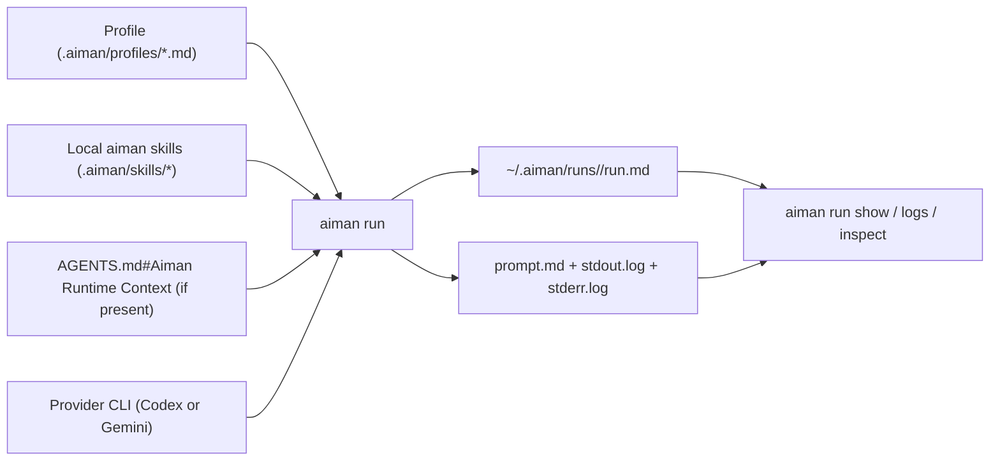

# `aiman`

> A small terminal workbench for running one profile at a time, then keeping a trustworthy record of what happened.

`aiman` is for teams that want a simple, human-first terminal app instead of a bigger orchestration system. You define profiles as Markdown files, optionally keep local `aiman` skills in the repo, optionally expose a narrow repo runtime context through `AGENTS.md`, run through Codex or Gemini, and inspect the saved run later through the OpenTUI workbench or the `run` commands.

## Why It Exists

Most agent tooling jumps quickly into orchestration, routing, and background systems. `aiman` stays narrower:

- one profile per run
- explicit profile files
- optional `AGENTS.md#Aiman Runtime Context`
- explicit local `aiman` skills
- persisted prompts, logs, and run metadata
- a small-terminal-first OpenTUI workbench plus simple CLI inspection

If you want a boring, inspectable way to author specialists and keep a durable record of each run, this is the shape.

## Mental Model



## Core Concepts

| Concept | What it is                                                         | Where it lives                             |
| ------- | ------------------------------------------------------------------ | ------------------------------------------ |
| Profile | A reusable prompt preset with YAML frontmatter and a Markdown body | `.aiman/profiles/` or `~/.aiman/profiles/` |
| Skill   | A local `aiman` skill that can be activated for a run              | `.aiman/skills/` or `~/.aiman/skills/`     |
| Run     | One execution of one profile                                       | `~/.aiman/runs/<run-id>/`                  |
| App     | The default interactive terminal UI                                | `aiman`                                    |

## Quick Start

### 1. Install dependencies

```bash
bun install
```

`aiman` now expects Bun for the interactive workbench and local development commands.

### 2. Make the CLI available everywhere

```bash
bun run install:global
```

That builds `dist/` and links the `aiman` binary so you can run `aiman ...` from any directory where Bun is available.

If you want to remove it later:

```bash
bun run uninstall:global
```

### 3. Create a profile

```bash
aiman profile create reviewer \
  --scope project \
  --provider codex \
  --mode safe \
  --model gpt-5.4-mini \
  --reasoning-effort medium \
  --description "Reviews diffs" \
  --instructions "Review the current patch and call out concrete bugs."
```

### 4. Inspect the profile

```bash
aiman profile show reviewer --scope project
```

### 5. Check it

```bash
aiman profile check reviewer --scope project
```

### 6. Run it

```bash
aiman run reviewer --scope project --task "Review my current changes"
```

### 7. Inspect the saved run

```bash
aiman
aiman run list --all
aiman run show <run-id>
aiman run logs <run-id>
aiman run inspect <run-id>
```

## CLI Overview

### Profile Commands

Use these to create and inspect authored profiles.

| Command                                          | Purpose                                       |
| ------------------------------------------------ | --------------------------------------------- |
| `aiman profile list [--scope project&#124;user]` | List available profiles                       |
| `aiman profile show <profile> [--scope ...]`     | Show one profile's provider, mode, and prompt |
| `aiman profile check <profile> [--scope ...]`    | Statically validate one profile               |
| `aiman profile create <name> ...`                | Create a new profile file                     |

### Skill Commands

Use these to inspect local `aiman` skills.

| Command                                        | Purpose                                                 |
| ---------------------------------------------- | ------------------------------------------------------- |
| `aiman skill list [--scope project&#124;user]` | List available skills with project-over-user precedence |
| `aiman skill show <skill> [--scope ...]`       | Show one skill's metadata and body                      |
| `aiman skill check <skill> [--scope ...]`      | Statically validate one skill                           |

### Run Commands

Use these to execute a specialist.

| Command                             | Purpose                                           |
| ----------------------------------- | ------------------------------------------------- |
| `aiman run <profile> --task <text>` | Run in the foreground and return the final result |
| `aiman run <profile> --detach`      | Start a background run and return immediately     |

Foreground runs wait for completion and print the final answer on success. Detached runs persist the same run contract, but execute from the launch snapshot already frozen into `run.md` and `prompt.md`.

### Session Commands

Use these to inspect what already happened.

| Command                                 | Purpose                                           |
| --------------------------------------- | ------------------------------------------------- |
| `aiman sesh list [--all] [--limit <n>]` | List active runs or recent history                |
| `aiman sesh show <run-id>`              | Show compact per-run status                       |
| `aiman sesh logs <run-id>`              | Read persisted stdout and stderr, optionally live |
| `aiman sesh inspect <run-id>`           | Read the full persisted evidence                  |

### TTY Surfaces

- `aiman` with no arguments opens the default OpenTUI workbench for creating, inspecting, stopping, and reusing runs.
- The workbench is real-TTY-only, small-terminal-first, and unifies launch plus run monitoring in one keyboard-first surface.
- `launch` is the default workspace for profile selection, profile details, and multiline task entry.
- `runs` keeps active and historic runs together, with answer/log/prompt details plus stop and reuse actions.

## How Profiles Work

An `aiman` profile is a Markdown file with YAML frontmatter plus a provider-native prompt body.

```md
---
name: hello
provider: gemini
description: Respond with a short, friendly greeting
mode: safe
model: gemini-2.5-flash-lite
reasoningEffort: none
---

## Role

You are the hello specialist.

## Task Input

{{task}}

## Instructions

Respond briefly and warmly.
```

### Required frontmatter

- `name`
- `provider`
- `description`
- `mode`
- `model`
- `reasoningEffort`

### Optional frontmatter

- `skills`

### `profile create` requirements

When creating a profile through the CLI, these flags are required:

- `--scope`
- `--provider`
- `--mode`
- `--model`
- `--reasoning-effort`
- `--description`

### Important prompt rule

`aiman` does not append a hidden runtime footer anymore. The profile body is the real prompt contract. If the profile should receive the caller's task, include `{{task}}` in the body.

### Explicit runtime context

If your repo needs shared guidance for all `aiman` runs, put it under `AGENTS.md#Aiman Runtime Context`.

`aiman` attaches only that section, not the whole router file. Keep it boring and stable: build/test commands, important paths, terminology, and safety rules. Keep task strategy and specialist behavior in the authored profile body instead.

For a drafting reference, see [`docs/agent-baseline.md`](./docs/agent-baseline.md).

For a stronger checklist on requirements, prompt shape, and reliability, see [`docs/agent-authoring.md`](./docs/agent-authoring.md).

Before first use, run `aiman profile check <name>`. It is a static validation pass: it does not launch the provider, probe MCPs, or require auth. Blocking errors fail with exit code `1`; warnings still exit `0`.

`reasoningEffort` is required, but the allowed values depend on the provider:

- `codex`: `none`, `low`, `medium`, or `high`
- `gemini`: `none`

Use `none` when the selected provider or model does not support configurable reasoning effort.

Profiles that use old fields such as `permissions`, `contextFiles`, or `requiredMcps` are invalid and should be rewritten to the current contract instead of migrated in place.

## How Skills Fit In

Local `aiman` skills are part of the rendered prompt contract:

1. A profile may declare `skills:` in frontmatter.
2. `aiman run` resolves those names from `.aiman/skills/` or `~/.aiman/skills/`.
3. The selected local skill bodies are attached to the rendered prompt as explicit run context.
4. The saved run keeps the resolved skill names for later inspection.

That means `aiman` owns local skill resolution and prompt attachment, not just bookkeeping.

`aiman` resolves skills from two locations:

- project scope: `.aiman/skills/<name>/SKILL.md`
- user scope: `~/.aiman/skills/<name>/SKILL.md`

Inspect them with:

```bash
aiman skill list
aiman skill show aiman-profile-authoring
aiman skill check aiman-profile-authoring
```

By default, `aiman skill list` applies the same project-over-user precedence that `aiman run` uses for resolving declared skill names.

Then declare it in profile frontmatter:

```yaml
skills:
   - aiman
```

## Using `aiman` From A Main Agent

`aiman` works best as a specialist runner called by a broader parent agent, wrapper, or automation.

Typical pattern:

1. The main agent decides which specialist to use.
2. It calls `aiman run <profile> ...`.
3. It reads the result directly, or inspects the saved session if it needs more evidence.
4. It keeps orchestration, memory, and next-step decisions outside `aiman`.

For a synchronous handoff:

```bash
aiman run reviewer --scope project --task "Review the current diff"
```

For a machine-readable handoff:

```bash
aiman run reviewer --scope project --task "Review the current diff" --json
```

For background execution:

```bash
aiman run reviewer --scope project --task "Review the current diff" --detach --json
aiman sesh show <run-id> --json
aiman sesh logs <run-id> --follow
aiman sesh inspect <run-id> --json
```

Practical rule:

- let the main agent own orchestration
- let `aiman` own one specialist run plus the persisted evidence
- let local `aiman` skills stay attached at the `aiman` run layer instead of re-expanding them in the parent

## How Runs Work

When you run a profile, `aiman`:

1. Resolves the profile from project or user scope.
2. Validates provider-specific requirements.
3. Renders `prompt.md` from the profile body and runtime placeholders.
4. Freezes an immutable launch snapshot in `run.md`.
5. Launches the provider CLI.
6. Captures stdout, stderr, and final result.
7. Lets you inspect the saved run later with `sesh` commands.

For detached runs, the worker reloads from the saved launch snapshot instead of re-reading the mutable profile file later.

Each run is stored under:

```text
~/.aiman/runs/<run-id>/
  run.md
  prompt.md
  stdout.log
  stderr.log
  artifacts/
```

`aiman` also keeps a global SQLite index at `~/.aiman/aiman.db`, so session commands work from any working directory and do not depend on scanning a project-local runs folder.

## Providers, Permissions, and MCPs

### Providers

Current providers:

- `codex`
- `gemini`

### Modes

Profiles declare their intended execution mode in frontmatter:

- `safe`
- `yolo`

If the caller passes an explicit mode override internally, it must still match the profile file. `aiman` will not silently widen or narrow access.

Provider behavior stays explicit:

- Codex `safe`: `codex exec --sandbox read-only`
- Codex `yolo`: `codex exec --sandbox workspace-write`
- Gemini `safe`: `gemini --approval-mode plan`
- Gemini `yolo`: `gemini --approval-mode auto_edit`
- Codex also uses per-command `--config` overrides so repo `AGENTS.md`, prompt-shaping project Codex instructions, and repo-defined Codex agent roles do not leak into authored `aiman` profiles.
- Gemini also uses a child-local settings overlay passed only to the spawned run so `context.fileName` points at an impossible filename and ambient `GEMINI.md`-style context does not leak into authored `aiman` profiles.

### Runtime context attachment

When `AGENTS.md` includes a `## Aiman Runtime Context` section, `aiman` appends only that section to the rendered prompt.
It does not attach the rest of `AGENTS.md`, and it intentionally blocks provider-native ambient repo prompt files from leaking into authored profile runs.

## Project vs User Scope

`aiman` can load profiles and skills from two places:

- project scope
- user scope

Default lookup prefers project scope when both define the same name. Use `--scope project` or `--scope user` when you want to force one side.

Home-level `~/.aiman` stays user scope only. It does not make `$HOME` count as a project root by itself, so project-specific profiles still win only when you are actually inside a project that defines them.

## Human vs Machine Surfaces

`aiman` has both human-friendly text output and machine-friendly JSON output.

- Use normal command output when you're working in a terminal.
- Use `--json` when a wrapper or another tool needs structured data.
- Use `aiman` only from a real TTY when you want the interactive OpenTUI workbench.
- Use `aiman run stop <run-id>` when you need to stop one active run from a non-TTY flow.

For automation and agentic tooling, prefer:

- `aiman sesh list`
- `aiman sesh show`
- `aiman sesh logs`
- `aiman sesh inspect`

## Development

### Useful commands

```bash
bun run dev
bun run install:global
bun run test
bun run test:provider-contract
bun run lint
bun run typecheck
bun run build
```

### Internal docs

If you want the deeper implementation details, start here:

- [`ARCHITECTURE.md`](./ARCHITECTURE.md)
- [`docs/agent-authoring.md`](./docs/agent-authoring.md)
- [`docs/agent-baseline.md`](./docs/agent-baseline.md)
- [`docs/cli.md`](./docs/cli.md)
- [`docs/agent-runtime.md`](./docs/agent-runtime.md)
- [`MEMORY.md`](./MEMORY.md)
